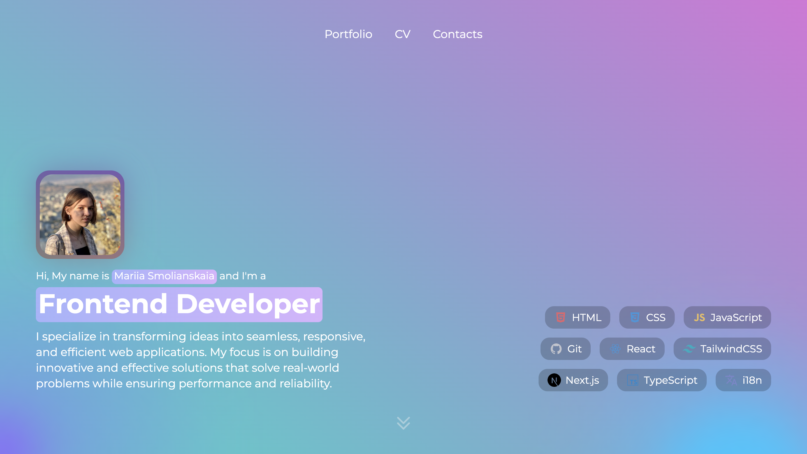
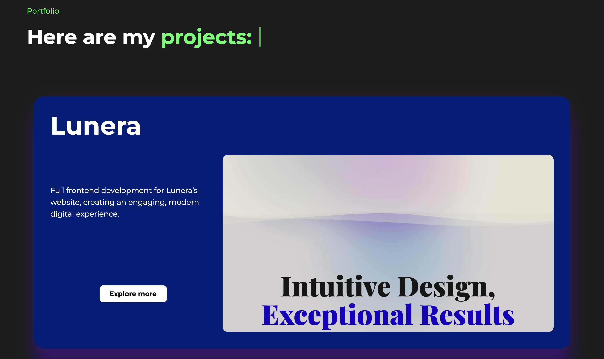

# Portfolio Website

Welcome to my portfolio website! This project showcases my work, experience, and projects, all wrapped up in a sleek and modern design. The portfolio is built with **React (Next.js)** and **TypeScript** and includes interactive features powered by **Aceternity UI** and **Framer Motion**. It is deployed live on **Vercel**.

## Table of Contents

- [About the Project](#about-the-project)
- [Key Features](#key-features)
- [Technologies Used](#technologies-used)
- [Projects](#projects)
- [Live Demo](#live-demo)
- [Contact](#contact)

## About the Project

This portfolio serves as a platform to introduce myself and display three of my most recent and notable projects. It includes several interactive UI elements and animations to provide a smooth user experience. I aimed to create a unique and visually appealing design using the **Aceternity UI library**, which provides highly customizable components, along with **Framer Motion** for fluid animations and transitions.

## Key Features

- **Personal Introduction**: A section that introduces me, my background, and interests.
- **Project Showcase**: Three featured projects, each with detailed descriptions and links to live demos.
- **Responsive Design**: The site is fully responsive, ensuring an optimized experience on any device.
- **Interactive Animations**: Implemented using Framer Motion for smooth transitions and engaging interactions.
- **Customizable UI**: Powered by the Aceternity UI library, making all components fully customizable.
- **Smooth Navigation**: Easy scrolling between sections like Portfolio, CV, and Contacts.
- **Downloadable CV**: Users can download my CV with a simple click, along with a toast notification.

## Technologies Used

- **React (Next.js)**: For building the user interface and server-side rendering.
- **TypeScript**: Ensuring type safety and improving code reliability.
- **Aceternity UI Library**: Customizable UI components used throughout the project.
- **Framer Motion**: For creating animations and transitions to enhance user experience.
- **Vercel**: Hosting and deployment for seamless integration and performance optimization.

## Projects

Here are the four projects featured in the portfolio:

1. **Lunera**: A modern digital agency website where I handled full frontend development, implementing responsive layouts, interactive animations, and smooth transitions to showcase the agency’s projects and services.

   - [Live Demo](https://lunera.studio/)

2. **Smllns Film Club**: A personal project showcasing my curated movie collection with over 2000 titles from Letterboxd. Features powerful search, detailed movie pages with TMDb integration, curated lists, and high-quality animations for an immersive browsing experience.

   - [Live Demo](https://smllns-film-club.vercel.app/)

3. **MoodFlow**: A comprehensive mood tracker with interactive charts and analytics to visualize daily emotions.

   - [Live Demo](https://moodflow-by-smllns.vercel.app/)

4. **CanvasBoard**: An online collaborative canvas board where multiple users can draw and create together in real-time.

   - [Live Demo](https://canvasboard-by-smllns.vercel.app/)

   ## Live Demo

You can check out the live version of the portfolio deployed on Vercel:

[Live Demo on Vercel](https://smllns-portfolio.vercel.app/)

## Contact

Feel free to reach out to me if you have any questions or opportunities!

- **Email**: [marysmoly@gmail.com](mailto:marysmoly@gmail.com)
- **LinkedIn**: [LinkedIn Profile](https://www.linkedin.com/in/smllns/)
- **GitHub**: [GitHub Profile](https://github.com/smllns)
